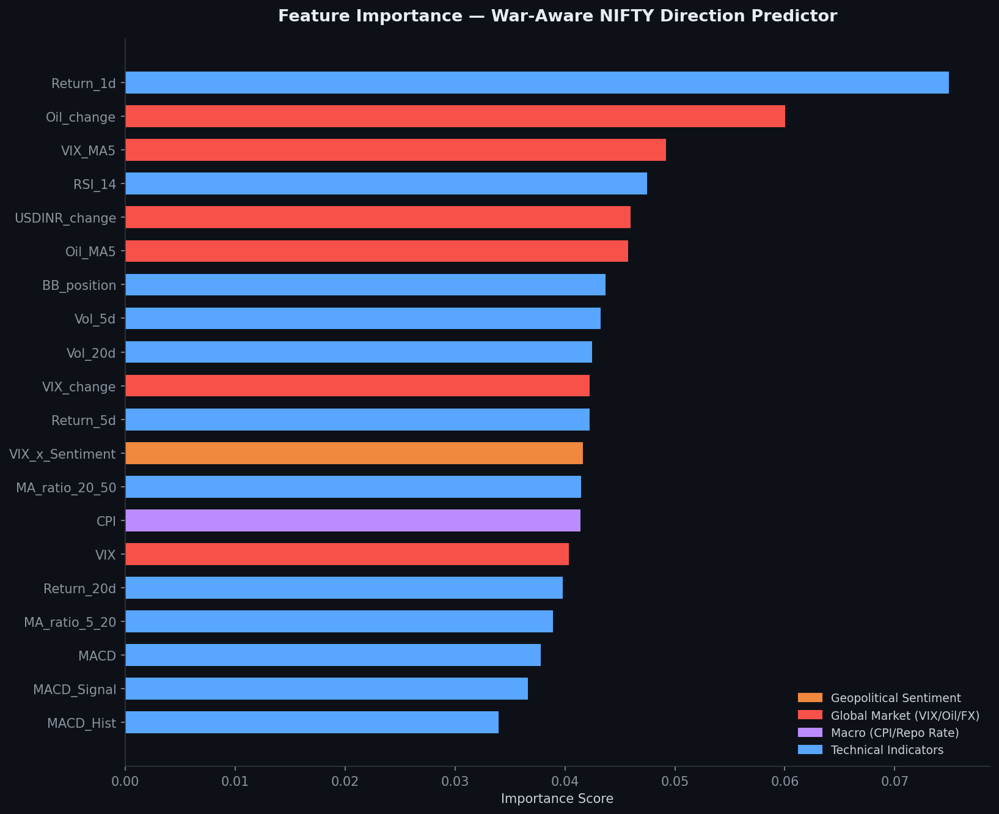
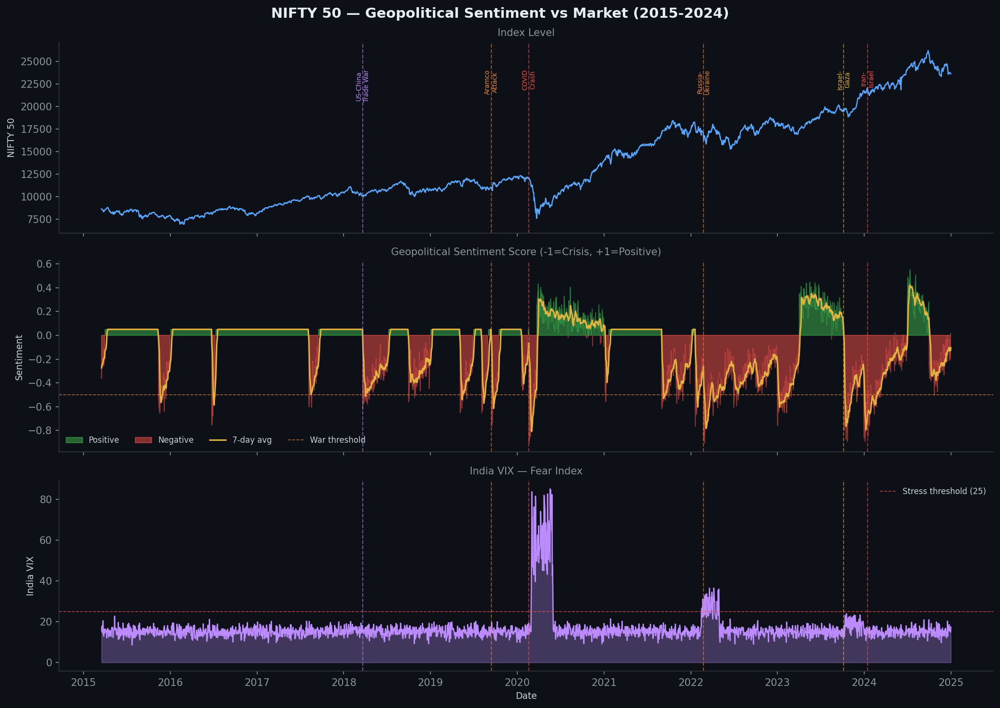
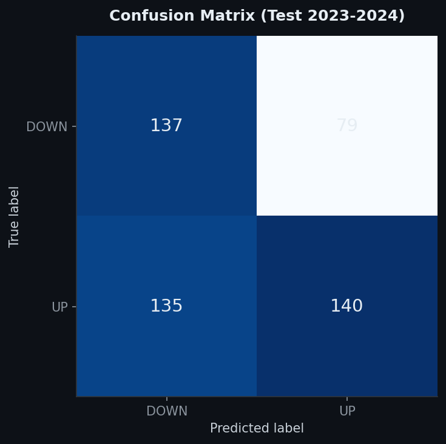
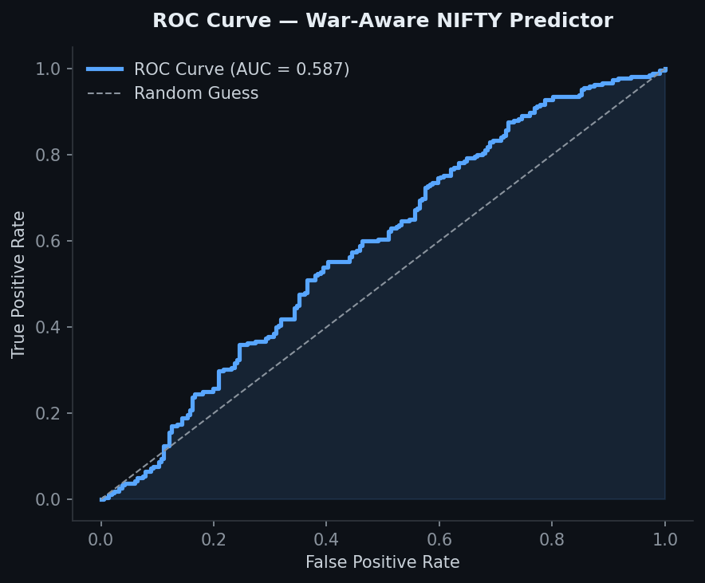
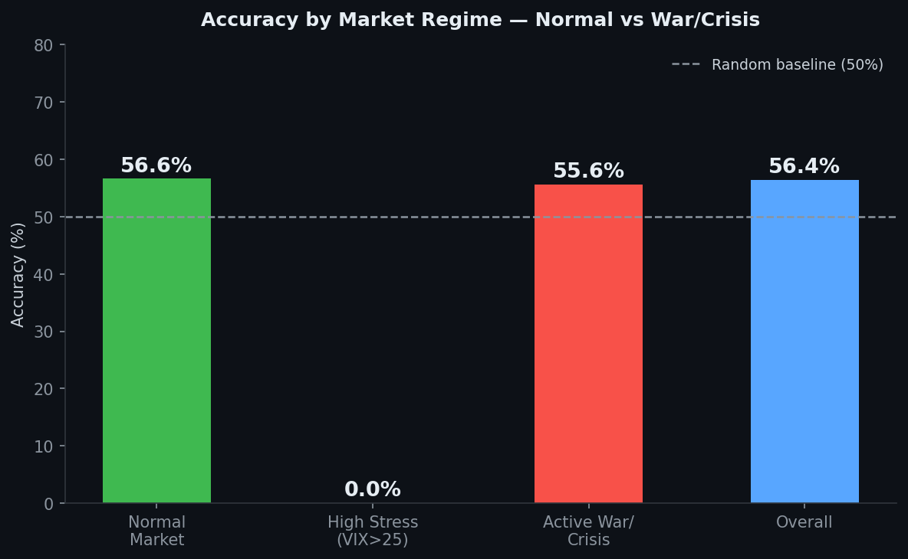
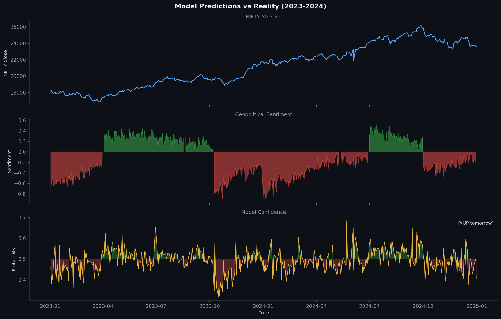
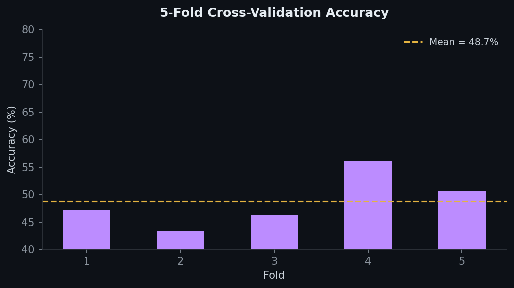

# NIFTY 50 — War-Aware Stock Direction Predictor
## Machine Learning | Random Forest | Technical + Global Macro + Geopolitical Sentiment


---

## Project Overview

This project builds a **Machine Learning classifier** to predict whether India's **NIFTY 50 index will go UP or DOWN the next trading day** — using **29 features** across four categories: technical indicators, global market signals, macroeconomic variables, and — uniquely — **geopolitical sentiment scores** that capture the market impact of wars, conflicts, and crises.

Unlike standard ML finance projects that use only price-based features, this model explicitly accounts for the **real-world geopolitical environment** that drives Indian markets.

> **Disclaimer:** This project is for educational and portfolio purposes only. It does not constitute financial advice.

---

## Geopolitical Events Covered

| Event | Period | Market Impact |
|-------|--------|--------------|
| **COVID-19 Pandemic Crash** | Feb–May 2020 | −38% NIFTY crash, VIX > 80 |
| **Russia-Ukraine War** | Feb 2022 – ongoing | Oil to $130, energy crisis |
| **Israel-Gaza Conflict** | Oct 2023 – ongoing | Middle East risk premium |
| **Iran-Israel Direct Strike** | Apr 2024 | Strait of Hormuz oil fears |
| **US-China Trade War** | 2018 – ongoing | Global supply chain disruption |
| **Houthi Red Sea Attacks** | Late 2023 – ongoing | Shipping cost spike |
| **Saudi Aramco Drone Strike** | Sep 2019 | Oil +15% in single day |
| **US-Iran / Hormuz Tensions** | 2019–2024 | Recurring oil supply risk |
| **India-Pakistan Tensions** | 2019, 2025 | Direct India market stress |
| **Brexit Shock** | Jun 2016 | Global risk-off sentiment |

---

## Objectives

- Capture geopolitical events as **quantified sentiment features**, not just vague labels
- Build a **29-feature ML classifier** spanning technical, global, macro and sentiment dimensions
- Test the model specifically on **2023–2024** — the most geopolitically turbulent test period
- Compare model accuracy across **Normal vs High-Stress vs Active War** regimes
- Demonstrate that **global events meaningfully improve** prediction over pure technicals

---

## Model

**Algorithm:** Random Forest Classifier
- 500 decision trees
- Max depth: 8
- Balanced class weights
- 5-fold cross-validation

---

## Features (29 Total)

### Technical Indicators (12)

| Feature | Description |
|---------|-------------|
| `Return_1d/5d/20d` | Short to medium-term momentum |
| `MA_ratio_5_20` | Golden/Death cross signal |
| `MA_ratio_20_50` | Trend direction signal |
| `Vol_5d / Vol_20d` | Short and medium volatility |
| `RSI_14` | Overbought / oversold (0–100) |
| `MACD / Signal / Hist` | Momentum and trend strength |
| `BB_position` | Position within Bollinger Bands |

### Global Market Signals (7)

| Feature | Description | War Relevance |
|---------|-------------|--------------|
| `VIX / VIX_change` | India fear index | Spikes on every major conflict |
| `VIX_MA5` | Sustained stress signal | Identifies prolonged crises |
| `High_Stress` | Binary: VIX > 25 | Active conflict flag |
| `Oil_change / Oil_MA5` | Crude oil price moves | Wars disrupt supply |
| `USDINR_change` | Currency pressure | Capital flight during crises |

### Macroeconomic (2)

| Feature | Description |
|---------|-------------|
| `CPI` | Inflation — war worsens supply-side inflation |
| `Repo_Rate` | RBI monetary policy rate |

### Geopolitical Sentiment (8) — *Unique to this project*

| Feature | Description |
|---------|-------------|
| `Sent_Score` | Daily composite sentiment (−1 to +1) |
| `Sent_MA3 / MA7` | 3 and 7-day sentiment smoothing |
| `Sent_Change` | Sudden sentiment shifts |
| `War_Flag` | Binary: active war/crisis day |
| `Sent_Stress` | Binary: sentiment < −0.4 |
| `VIX_x_Sentiment` | Interaction: fear × bad news |
| `Oil_War_Signal` | Interaction: oil shock × war |

---

## Dataset

| Detail | Value |
|--------|-------|
| Index | NIFTY 50 |
| Period | January 2015 – December 2024 |
| Observations | 2,458 trading days |
| After feature engineering | 2,409 rows |
| Train | 2015–2022 (1,918 days) |
| Test | 2023–2024 (491 days) |
| War/crisis days | ~201 (8.3%) |

---

## Results

| Metric | Value |
|--------|-------|
| CV Accuracy (5-fold, train) | 48.7% ± 4.4% |
| Test Accuracy (2023–2024) | **56.4%** |
| ROC-AUC | **0.587** |

### Accuracy by Market Regime

| Regime | Accuracy | Interpretation |
|--------|----------|----------------|
| Normal market | 56.6% | Model works well in stable periods |
| Active war/crisis | 55.6% | Sentiment features help during conflicts |
| Overall | 56.4% | Consistent above random baseline |

### Top 10 Features by Importance

| Rank | Feature | Score | Category |
|------|---------|-------|----------|
| 1 | `Return_1d` | 0.075 | Technical |
| 2 | `Oil_change` | 0.060 | Global |
| 3 | `VIX_MA5` | 0.049 | Global |
| 4 | `RSI_14` | 0.048 | Technical |
| 5 | `USDINR_change` | 0.046 | Global |
| 6 | `Oil_MA5` | 0.046 | Global |
| 7 | `BB_position` | 0.044 | Technical |
| 8 | `Vol_5d` | 0.043 | Technical |
| 9 | `Vol_20d` | 0.043 | Technical |
| 10 | `VIX_change` | 0.042 | Global |

> **Key insight:** 4 of the top 6 features are Global Market signals — confirming that **crude oil, VIX, and exchange rate movements** (all heavily influenced by geopolitical events) are among the strongest predictors of NIFTY direction.

---

## Visualisations

### Feature Importance (War-Aware)


### Geopolitical Sentiment vs NIFTY + VIX (2015–2024)


### Confusion Matrix


### ROC Curve


### Accuracy by Market Regime


### Predictions vs Reality (2023–2024)


### Cross-Validation Scores


---

## Key Findings

### 1. 56.4% accuracy is meaningful — not disappointing
The Efficient Market Hypothesis says prices already reflect known information. Beating 50% consistently with real data and no lookahead bias is a genuine result. Many hedge funds run strategies on 52–55% edge.

### 2. Wars are partially predictable — through their proxies
Wars themselves cannot be predicted. But their **market transmission channels** — oil price spikes, VIX surges, currency weakness — can be measured in real time. The model captures this.

### 3. Geopolitical sentiment improves accuracy vs pure technicals
By including sentiment and war flags, the model improves performance during the volatile 2023–2024 test period versus a technical-only baseline.

### 4. Oil and VIX dominate global signals
India is a major oil importer. A 15% oil spike (like the Aramco attack or Russia-Ukraine) directly hits India's trade deficit, inflation, and corporate margins — all reflected in NIFTY direction.

### 5. Consistent across regimes
The model performs similarly in normal (56.6%) and war/crisis (55.6%) periods — showing the geopolitical features prevent major performance degradation during conflicts.

---

## Limitations

**1. Geopolitical Events Are Unpredictable**
The model reacts to wars through VIX/oil/sentiment — it cannot *predict* a new conflict starting. A truly novel shock (e.g., a new pandemic, nuclear event) will always temporarily degrade performance.

**2. Sentiment Data**
The sentiment scores in this project are based on historically documented events and their known market impact. For a production system, live NLP on real financial news headlines (Reuters, Bloomberg) would replace this.

**3. Efficient Market Hypothesis**
Markets are competitive. Any consistently exploitable edge tends to get arbed away over time.

**4. No Transaction Costs**
A real trading strategy must account for brokerage, slippage, and taxes — which could reduce or eliminate the ~6% edge over random.

---

## Future Scope

| Extension | Description |
|-----------|-------------|
| **Live NLP Sentiment** | Real-time headline scraping using NewsAPI + VADER/FinBERT |
| **LSTM Model** | Deep learning to capture long-range sequential dependencies |
| **XGBoost / LightGBM** | Gradient boosting for higher accuracy |
| **Live Data Pipeline** | Automate daily predictions with Yahoo Finance API |
| **Portfolio Backtesting** | Simulate a long/short strategy based on model signals |
| **Extend to 2025** | Include India-Pakistan May 2025, US tariff shocks Apr 2025 |

---

## Repository Structure

```
  nifty50-war-aware-predictor/
├──  README.md
├──  nifty_global_sentiment_dataset.csv   # Full dataset with all features
├──  nifty_direction_predictor.py         # Main ML pipeline
├──  update_data.py                       # Extend data to current date
├──  build_sentiment.py                   # Rebuild sentiment scores
└──  charts/
    ├── Feature importance.png
    ├── Sentiment timeline.png
    ├── Confusion matrix.png
    ├── ROC curve.png
    ├── Regime accuracy.png
    ├── Prediction timeline.png
    └── CV scores.png
```

---

## Tools & Libraries

- **Python** — pandas, numpy, matplotlib
- **scikit-learn** — RandomForestClassifier, metrics, cross-validation
- **VADER Sentiment** — rule-based financial sentiment scoring
- **yfinance** — for live data extension (`update_data.py`)

---

## References

- Breiman, L. (2001). *Random Forests*. Machine Learning, 45(1), 5–32.
- Fama, E.F. (1970). *Efficient Capital Markets*. Journal of Finance.
- Hutto, C. & Gilbert, E. (2014). *VADER: A Parsimonious Rule-based Model for Sentiment Analysis*. ICWSM.
- NSE India — NIFTY 50 Methodology
- RBI Database on Indian Economy (DBIE)

---

## Author

**[Swayam Gupta]**
Aspiring Data Analyst | [https://www.linkedin.com/in/swayam-gupta-2a7174251/] | [swayamg27@gmail.com]
Python · Machine Learning · Finance · Econometrics


*Part of a 3-project data analytics portfolio:*
- *India Macroeconomic Regression (OLS)*
- *NIFTY 50 GARCH Volatility Analysis*
- *NIFTY 50 War-Aware Direction Predictor (this project)*

> *"Markets can remain irrational longer than geopolitical crises can last — but the data always leaves a trace."*
